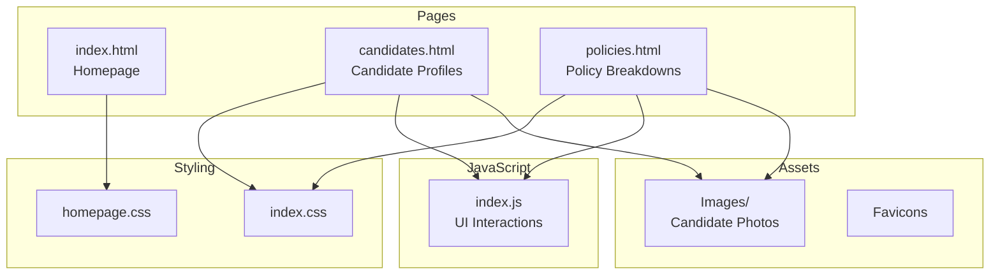

# Architecture Overview

## System Diagram

## Component Descriptions

### Homepage (index.html)
- **Purpose**: Landing page introducing MyVote Project's mission
- **Location**: `/index.html`
- **Key responsibilities**:
  - Displays organization overview and mission
  - Links to GoFundMe charity campaign
  - Navigation to other pages

### Candidates Page (candidates.html)
- **Purpose**: Profiles of 2020 presidential candidates
- **Location**: `/candidates.html`
- **Key responsibilities**:
  - Displays candidate photos using CSS sprite technique
  - Shows candidate overview and policy stances
  - Provides searchable dropdown navigation
  - Links directly to candidate sections via anchor tags

### Policies Page (policies.html)
- **Purpose**: In-depth policy issue analysis
- **Location**: `/policies.html`
- **Key responsibilities**:
  - Presents policy descriptions with expandable "read more" sections
  - Shows pro/con arguments in table format
  - Displays candidate stances via modal popups
  - Includes "Share Your Voice" survey functionality

### Shared JavaScript (index.js)
- **Purpose**: Common interactive functionality
- **Location**: `/js/index.js`
- **Key responsibilities**:
  - `toggleDropdown()` - Shows/hides navigation dropdowns
  - `filterFunction()` - Searches within dropdown menus
  - `readMore()` - Expands/collapses content sections
  - `toggleShare()` - Shows/hides survey popup
  - `toggleButton()` - Shows/hides candidate stance popups
  - `openCharity()`, `openVolunteer()`, `openExperience()` - External link handlers

## Data Flow

1. User lands on homepage and learns about MyVote Project
2. User navigates to Candidates page to research presidential candidates
3. User can search for specific candidates via dropdown or scroll through profiles
4. User navigates to Policies page to understand issues from multiple perspectives
5. User can click "Candidates Stance" buttons to see where candidates stand on each issue
6. User can share their own views via the "Share Your Voice" survey

## External Integrations

| Service | Purpose | Documentation |
|---------|---------|---------------|
| GoFundMe | Charity donations | Linked via button/image |
| Google Forms | Volunteer signup & feedback | External form links |
| NYT Image Sprite | Candidate photos | CSS background-image technique |

## Key Architectural Decisions

### Static Site Architecture
- **Context**: Needed a simple, fast-loading voter education platform
- **Decision**: Pure HTML/CSS/JS without frameworks or build tools
- **Rationale**: Minimizes complexity, ensures compatibility, requires no server-side code

### CSS Sprite for Candidate Photos
- **Context**: Needed to display many candidate photos efficiently
- **Decision**: Used NYT's public candidate image sprite with CSS background-position
- **Rationale**: Single HTTP request for all photos, faster page load

### Modal Popups for Stance Comparisons
- **Context**: Users needed quick access to candidate positions without leaving their place
- **Decision**: Absolute-positioned popups that appear inline with content
- **Rationale**: Keeps user context while providing quick reference information

### Expandable Content Sections
- **Context**: Policy information is detailed but shouldn't overwhelm users
- **Decision**: "Read more" buttons hide detailed content by default
- **Rationale**: Progressive disclosure improves scannability while preserving depth
